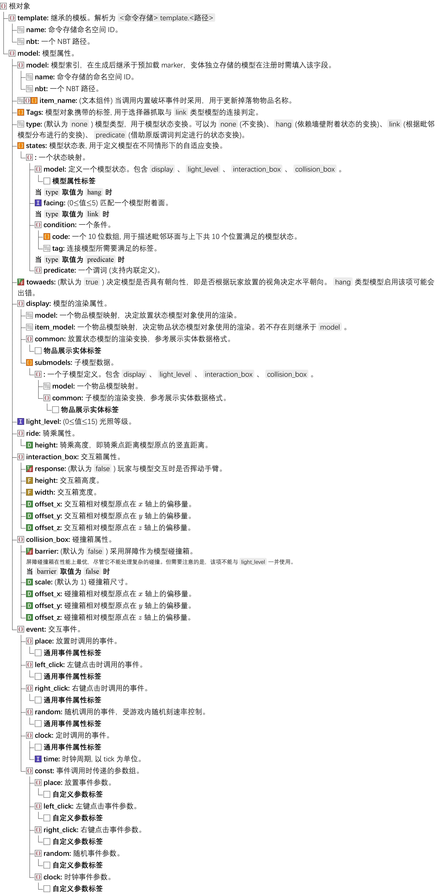
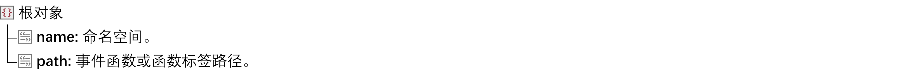

# NatureCraft

> Datapack 轻量级自定义交互模型支持库.

## 功能

- 三个平移自由度的碰撞箱与交互箱设置;
- 光照;
- 多模型混合;
- 简单的交互事件;
- 模拟随机刻(受 `minecraft:random_tick_speed` 规则控制);
- 周期事件;
- 复合结构支持;
- 可以坐的椅子;
- 可供配置的状态映射 (提供了三种映射方式, 分别为**朝向**、**范围内模型关系检查**和**谓词**).

## 文件夹结构

在数据包中, 每一个 NC 模型都由一个模型文件定义。以下的文件结构图展示了 NC 模型相关文件在数据包中的位置:


## 模型定义格式

模型定义文件是 NC 模型在数据包中的数据驱动定义文件。

### 定义格式

我们推荐将 NC 模型文件 (下文简称模型文件) 在 *data/<命名空间>/function/data/model* 目录内定义。

模型文件采用**函数注册**的方式, 通过编辑 SNBT 对象将模型类注册进**命令存储 (Command storage)** 文件中, 其具有下列结构:



### 通用事件属性标签

事件解析为 *<命名空间>:data/event/\<path\>.mcfunction*。



### 状态变换

> [!TIP]
>
> NC 原生只提供了三种简单的状态变换机制, 对于更加复杂的情况可以通过模型对象的 `place` 事件, 在放置函数里更自由地根据模型环境提供模型状态变换。

#### link 类型模型的状态变换机制

关于 `link` 类型模型状态映射的code键, 顺序满足 `[上,西北,北,东北,西,东,西南,南,东南,下]`, 即:

```mcfunction
"code":[
	↑,
NW, N,NE,
 W,    E,
SW, S,SE,
    ↓
],
```

数组中可写入以下值:

|  值  |               内容               |
| :--: | :------------------------------: |
|  1   |  目标位置应存在带标签的模型对象  |
|  0   | 目标位置不应存在带标签的模型对象 |
|  -1  |        对目标位置不做要求        |

更新范围如图所示 :


## 模板定义格式

模板定义文件是对模型类的抽象, 其定义了一些通用属性, 在模型定义的 *template* 字段中调用。

### 定义格式

我们推荐将 NC 模板文件 (下文简称模板文件) 在 *data/<命名空间>/function/data/template* 目录内定义。

模板文件与模型文件一致, 也采用函数进行注册, 其 SNBT 结构**与模型属性完全一致**。将上文模型定义格式的 `model` 字段直接作为根对象即可定义模板数据文件。

## 模型数据格式 (物品)

(待补充...)

## 模型数据格式 (实体)

(待补充...)

## 事件

### 事件注册

我们推荐将 NC 模型事件 (下面简称模型事件) 在 *data/<命名空间>/function/data/event* 目录内定义。

#### 模型对象

模型对象为一个复合实体, 其默认由下列实体组合而成:

|        Entity         |                   Tags                    | Index score |
| :-------------------: | :---------------------------------------: | :---------: |
|      Marker (@s)      |            `NatureCraft.data`             |      ✅️      |
|  Interaction (main)   |       `NatureCraft.interaction_box`       |      ✅️      |
|        Shulker        |        `NatureCraft.collision_box`        |      ❌️      |
| Interaction (shulker) |        `NatureCraft.collision_box`        |      ✅️      |
|  Item_display (root)  | `NatureCraft.display`, `NatureCraft.root` |      ✅️      |
|  Item_display (sub)   |           `NatureCraft.display`           |      ❌️      |

同一个模型对象下的实体共享一个**索引分数 (Index score)**, 上表中不包含索引分数 (即 **Index score** ❌️) 的实体依赖骑乘关系。

|        根实体         |      骑乘实体      |
| :-------------------: | :----------------: |
| Interaction (shulker) |      Shulker       |
|  Item_display (root)  | Item_display (sub) |

> [!WARNING]
>
> 在为实体组中添加任意静态实体时, 你应该为其添加与 marker 一致的分数索引 (通过 `NatureCraft.uid` 计分板来实现这一点)。但当其为**骑乘实体**时, 你不应这样做, 这会导致对已放置模型进行移动时骑乘关系的丢失, 会影响到部分逻辑对实体的追踪。

#### 执行环境 (上下文)

**执行者:** 模型对象的 marker, 携带 `NatureCraft.data` 标签。

**执行位置:** 模型对象 marker 的位置。

> [!NOTE]
>
> **Q.A: 如何在事件中选中实体组中的其它实体?**
>
> 在一次模型事件中, 会为每个携带与 marker 索引分数一致的实体添加 `NatureCraft.target` 标签, 在选择器中写入 `[tag=NatureCraft.target]` 即可在上下文内筛选出目标实体组的组分进行管理。
>
> ```mcfunction
> execute as @e[tag=<...>,tag=NatureCraft.target]
> ```
>
> 对于不包含索引分数的骑乘实体可通过上述步骤先选中根实体再通过 `execute on` 子命令对骑乘实体进行筛选。
>
> ```mcfunction
> execute as @e[tag=<...>,tag=NatureCraft.target] on passengers @s[tag=<...>]
> ```
>
> **Q.B: 如何在事件中选中执行事件的玩家?**
>
> 通过选择器与 `execute on` 子命令, 我们可以将目标实体切换为玩家。
>
> ```mcfunction
> execute as @e[tag=NatureCraft.target,tag=NatureCraft.interaction_box,limit=1] on target
> ```
>
> 针对放置事件 `place` , 也可直接采用 `@a` 选择器进行抓取 (性能更优)。
>
> ```mcfunction
> execute as @a[tag=NatureCraft.target,limit=1]
> ```

#### 事件参数

考虑到部分模型事件存在需要传入模型参数的需求, 可在模型的定义格式的 `const` 键中写入需要的参数供事件函数调用。对于直接调用的事件函数可直接使用函数宏接收参数, 对于间接调用的事件函数, 我们采用以下方式进行参数传递:

```mcfunction
function #namespace:example with storage naturecraft:main const
```

同时在事件中我们可以对命令存储 `naturecraft:main const` 进行修改以支持动态适应的参数类型。

### 内置事件

|       事件函数        |                             功能                             | 参数 |
| :-------------------: | :----------------------------------------------------------: | :--: |
| naturecraft:base/kill | 清除带有 `target` 标签的实体, 特别的, 带有 `self` 标签的目标不会被清除. |  -   |

## 自然生成

> [!CAUTION]
>
> 不要尝试使用该功能实现自定义地物 (如自定义的花、草、石子等), 这可能会造成过高的性能开销。
>
> 该功能尚处于测试阶段, 可能存在未知BUG, 请谨慎在您的世界中使用!

除去玩家手动放置生成模型对象外, NC 库也支持通过配置世界生成文件来使得模型自然生成在世界上。为了实现这点，读者需要了解[世界生成/结构](https://zh.minecraft.wiki/w/自定义世界生成#结构)相关内容。

通过将存有模型数据的 marker 保存于结构内并添加 `NatureCraft.natural` 标签, 当世界调用对应结构时便会加载目标模型对象。

## 接口函数 (API)

|               接口函数               |                   效果                   | 参数 |
| :----------------------------------: | :--------------------------------------: | :--: |
| naturecraft:place/init/states/link/0 | 对临近的 `link` 类型模型发送一次状态更新 |  -   |

## 其他

### 计分板与命令存储

#### 计分板

**`NatureCraft.var`** : 传参、运算用计分板。

**`NatureCraft.uid`** : 一个递增序列uid计分板, 每组模型都会分配一个独立的值用于绑定交互。

#### 命令存储

**`naturecraft:main`** : 用于具体逻辑的实现。

- 拥有时钟事件和随机刻事件的模型 Marker 实体会携带 `NatureCraft.clock` 和 `NatureCraft.randomtick` 标签;

- 模型类型为 `link` (连接模型) 时模型 Marker 实体会携带 `NatureCraft.link` 标签;

## 更新 

- 完成了附着类模型的放置逻辑;
- 添加了复合模型来绕过Java模型只能单轴旋转的问题~~但功能不完善, 目前仅适用于静态~~(Java1.21.11更新解除了模型单轴旋转限制, 但其仍可作为可连接模型的子模型使用);
- 添加了连接模型的状态更新功能;
- 添加了时钟事件与随机刻事件;
- 添加了新的碰撞箱类型 `barrier`;
- 添加了状态条事件 `naturecraft:data/event/base/statusbar/0`, 可以在其它事件中调用该事件来在模型的 y 轴方向渲染一个状态条；
- 添加了新的破坏事件 `naturecraft:data/event/base/group/break3` 用于多次受击确认(防止模型被误触破坏), 可搭配状态条事件使用；
- 添加了新的破坏事件 `naturecraft:data/event/base/group/break2` 用于按战利品表生成掉落物的破坏事件;
- 现在可以在自定义结构中调用模型生成了, 只需在 **Marker** or **Item frame** 上添加 `NatureCraft.natural` 标签用于识别;
- 现在模型实体可以继承`custom_model_data`(通过在物品的`custom_data`组件中加入`custom_model_data`字段);
- 现在模型实体可以继承`item_name`(注册函数中的`item_name`字段), 用于兼容模组 `Jade🔍` 对展示实体名称的显示;
- 添加了`add_custom_model_data`事件, 可以通过调用该事件向掉落物传递`custom_model_data`组件, 使用该事件时应在`naturecraft:main`命令存储下的`io.stack`压入一个栈元素用来存储物品数据;
- 将物品展示实体的基底物品从`chest`更改为`paper`(仍可调用`container`组件)以支持透明贴图.
- 添加了 `consume` 物品修饰器用于将物品堆叠数量 -1;
- 添加了 `single` 物品修饰器用于将物品堆叠数量设置为 1;
- 为 `kill` 事件添加了对携带 `self` 标签的实体的特判;
- 添加了 `uid_matcher` 谓词用在选择器中匹配相同uid的实体, 使用前需将目标uid存入 `#uid NatureCraft.var` 中;
- 添加了 `predicate` 类型模型的状态映射;

### 待办

- 游戏内模型注册;
- 模型堆叠(类海泡菜);
- GUI模型管理;
- 更多内置事件;
- 实体碰撞箱动态更新；
- 添加 `slime` 类型交互箱兼实体碰撞箱, 用于受击监听；
- 移动事件中需保证移动后的骑乘关系不发生变化 (可仿 kill 事件, 对骑乘目标添加 `ride` 标签在移位事件中作特判);

### 优化

- 调整了模型放置阶段的数据调用, 现在会检查 storage data 而不是 entity data;

### BUG修复

- 修复了通用模型放置在不完整表面吞方块的BUG~~悬挂模型的还没修~~;
- 修复了 `NatureCraft.data` 未骑乘于 `NatureCraft.root` 的BUG;
- 修复了由于修复吞方块BUG导致的无朝向模型随机转向的BUG;
- 修复了由于更改数据取调地址但更改不完全导致的BUG;
- 修复了结构生成时uid混乱的BUG;
- 修复了 `hang` 模型原点与接触面不贴合的BUG;
- 修复了移动模型时导致骑乘实体脱离的BUG;

---

**更新日期**: 2026/02/25.
